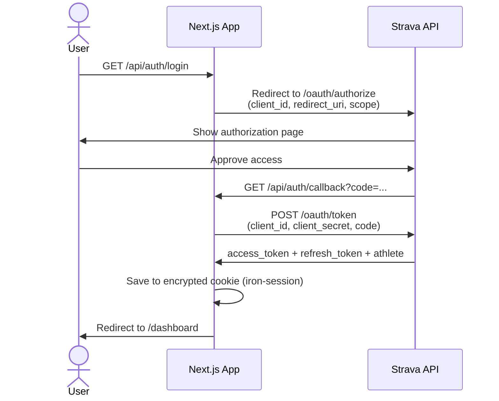
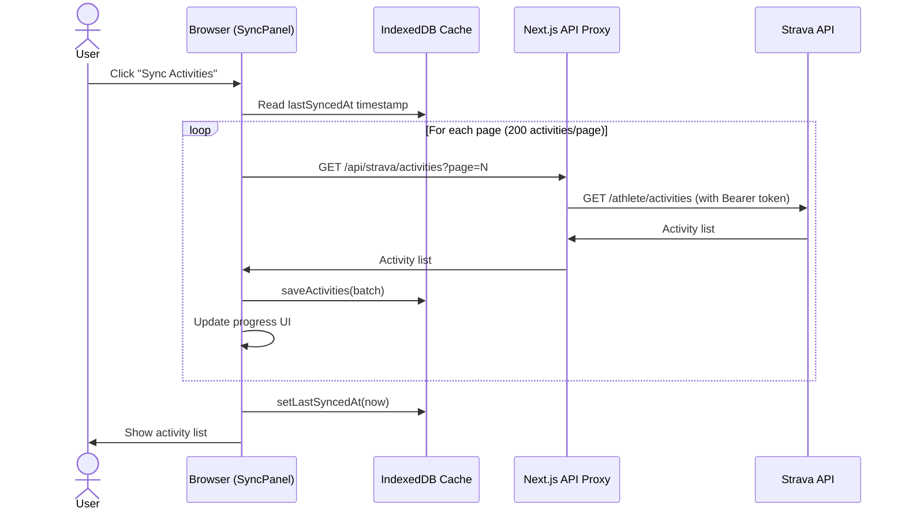

# Strava Heatmap

A production-ready PWA that visualizes your Strava runs as interactive heatmaps - route overlap intensity, elevation gradient, and heart rate gradient.

## Tech Stack

- **Next.js 15** (App Router, TypeScript)
- **Tailwind CSS**
- **iron-session** - encrypted cookie-based sessions
- **deck.gl** - GPU-accelerated heatmap rendering _(coming soon)_
- **Vercel** - hosting

## Getting Started

1. Clone the repo and install dependencies:

```bash
npm install
```

2. Copy the example env file and fill in your values:

```bash
cp env.example .env.local
```

3. Register your app at [strava.com/settings/api](https://www.strava.com/settings/api) and set:
   - **Authorization Callback Domain:** `localhost`

4. Run the dev server:

```bash
npm run dev
```

Open [http://localhost:3000](http://localhost:3000).

## Environment Variables

| Variable | Description |
|---|---|
| `STRAVA_CLIENT_ID` | From strava.com/settings/api |
| `STRAVA_CLIENT_SECRET` | From strava.com/settings/api |
| `SESSION_SECRET` | Random string ≥32 chars for cookie encryption |
| `NEXTAUTH_URL` | Base URL (`http://localhost:3000` in dev) |

## OAuth Flow



### Token Lifecycle

- Access tokens expire every **6 hours** - the app refreshes them automatically on API calls.
- Tokens are stored in an **httpOnly, encrypted cookie** - never exposed to client-side JavaScript.
- Logout hits `/api/auth/logout` which destroys the session cookie.

## Activity Sync Flow

On first load the app fetches all your Strava activities and caches them locally in IndexedDB. Subsequent syncs only fetch activities newer than the last sync timestamp - keeping API usage well within Strava's rate limits (1000 req/day).



> The API proxy (`/api/strava/activities`) reads the access token from the session cookie server-side - the token is never exposed to the browser.

## Project Structure

```
src/
  app/
    page.tsx                        # Login page
    dashboard/
      page.tsx                      # Server component - reads session, renders layout
      SyncPanel.tsx                 # Client component - sync logic + activity list
    api/
      auth/
        login/route.ts              # Redirects to Strava OAuth
        callback/route.ts           # Exchanges code for tokens, sets session
        logout/route.ts             # Destroys session cookie
      strava/
        activities/route.ts         # Proxy: fetches activities with server-side token
  lib/
    session.ts                      # iron-session config + SessionData type
    strava.ts                       # Typed Strava API client (fetchActivities, fetchActivityStream)
    dt.ts                           # IndexedDB schema + helpers (activities, streams, meta)
```
